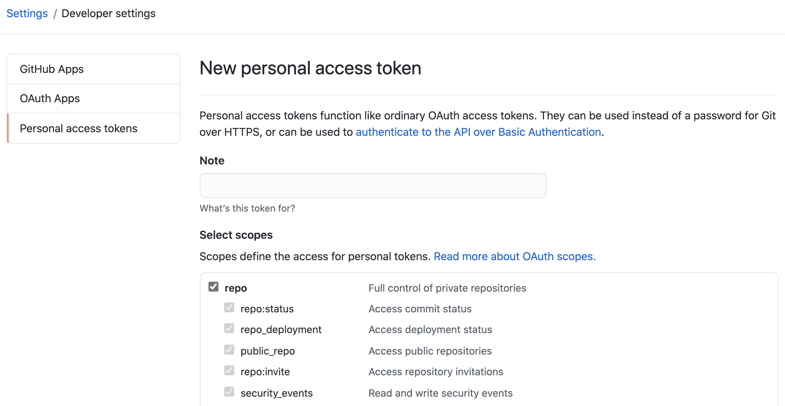

Analysis of COVID-19 patients with Neurological Conditions
================

## Site information

Before running the package, please confirm your site parameters on
[this google
sheet](https://docs.google.com/spreadsheets/d/1epcYNd_0jCUMktOHf8mz5v651zy1JALD6PgzobrGWDY/edit?usp=sharing).
If anything is incorrect or if your site is not there, please notify
Meghan Hutch via Slack to make correction.

*Note*: `icd_version = 9` when the site’s ICD codes are primarily of
version 9, and `include_race = FALSE` when site does not have race
information.


## Important notes for terminal/command line users

This analysis can take take a bit of time to run. At NWU, it takes ~2.5 hours to run the analysis on our cohort of ~6700 patients. 

For this reason, it's recommended to call a `screen` session in your terminal before opening R and running the package. This will keep your R session running in case the terminal itself freezes/loss of internet connection. 


If your terminal closes, you can reopen the screen session running the package with the following commands:

First identify the name of your screen session

```
screen -ls
```

Reopen the session with:

```screen -S session_name```

If you are using docker and your terminal session times out, use the following to reopen the docker container:

```docker attach `docker ps -q -l````

OR

```docker exec -it <container name> bash```


# Install and run the package

This package can be run with or without docker. Please review **section A** to run the package via docker, and **section B** to run without the docker.

## A. Docker

Now that you have verified your site specifics, on the command line,
open the Docker container, replacing `your_path_here` with the path to
the directory containing folder `Input` (where your site-specific
datasets are stored):

``` bash
docker run \
  --name neuro4ce \
  --volume your_path_here:/4ceData \
  --rm -it \
  dbmi/4ce-analysis:version-2.1.0 R
```

### While in Rstudio or Terminal R session:

The above lines should open up the interactive R environment on your
terminal. Now, while in R, install the development version of
**Phase2.1NeuroRPackage** from GitHub with remotes and run:

``` r
remotes::install_github('covidclinical/Phase2.1NeuroRPackage',
                        subdir = 'FourCePhase2.1Neuro',
                        upgrade = FALSE)

library(Phase2.1NeuroRPackage)
runAnalysis()
```

## B. Run without Docker

To run without docker, open a Rstudio or R sessson on your terminal and input the following code, while ensuring the following: 

* `'SITEID'` should specify your site's 4CE identifier exactly as it appears here in [column A](https://docs.google.com/spreadsheets/d/1epcYNd_0jCUMktOHf8mz5v651zy1JALD6PgzobrGWDY/edit#gid=0). 

* `is_docker` is set to FALSE 

* `data_dir` is set to the folder you are keeping your Phase2.1 files

* `output_dir` should be set to where you'd like the resulting .rda file to be saved

```{r
remotes::install_github('covidclinical/Phase2.1NeuroRPackage',
                        subdir = 'FourCePhase2.1Neuro',
                        upgrade = FALSE)

library(Phase2.1NeuroRPackage)
runAnalysis(is_docker = FALSE, currSiteId = 'SITEID', data_dir = '/4ceData/Input', output_dir = '/4ceData')
```

## Submit

Finally, please submit the results to
[Phase2.1NeuroRSummariesPublic](https://github.com/covidclinical/Phase2.1NeuroRSummariesPublic):

-   Share with @meghutch your GitHub handle via direct message or the
    \#neuro Slack channel so you can be added as contributor to the
    repository.
-   Note that you would need to use a token to access **private** repos,
    see
    [here](https://docs.github.com/en/github/authenticating-to-github/creating-a-personal-access-token).
    Briefly, to generate a new token, go to your GitHub settings -&gt;
    Developer settings -&gt; Personal access tokens -&gt; Generate.

 Finally, run:

``` r
submitAnalysis()
```

#### Submission via email or slack

If everything runs smoothly, your results would also be saved under
`your_path_here` (where you specified the `Input` folder earlier). For
example, for me, it’s `/data2/home/ttle/4ce/UPENN_results.rda`. If
somehow `submitAnalysis()` didn’t allow you to upload the results to
[Phase2.1NeuroRSummariesPublic](https://github.com/covidclinical/Phase2.1NeuroRSummariesPublic),
you can share the results file with @meghutch via the
\#neuro Slack channel or by email meghan.hutch@northwestern.edu


## C. Other notes

As reference, site obfuscation parameters (`mask_thres` and `blur_abs`)
are
[here](https://docs.google.com/spreadsheets/d/1Xl9juDBXt86P3xQtsoTaBl2zPl1BIiAG9DI3Rotyqp8/edit#gid=212461777).

To get back to the command line at any point, type `quit()` in the R
environment. Note that this will exit the container, and you would have
to open another one and reinstall the package if you want to rerun.

If you run into any problem adapting this code to your data, let us know
via Slack or [submit an
issue](https://github.com/covidclinical/Phase2.1NeuroRPackage/issues/new).

Thank you very much for your contribution!
